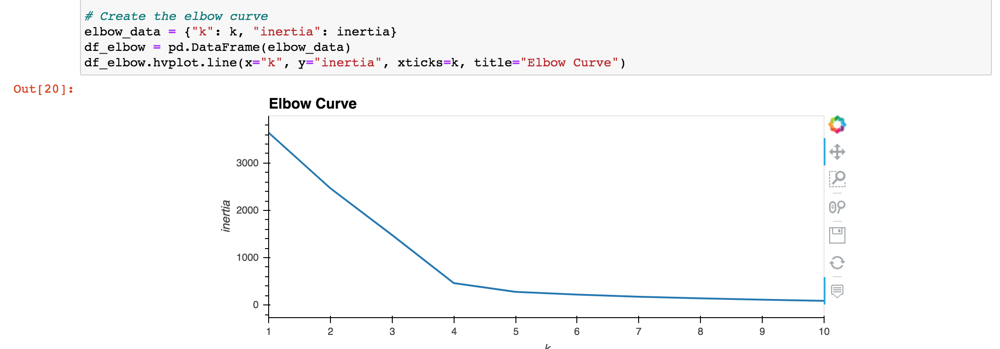
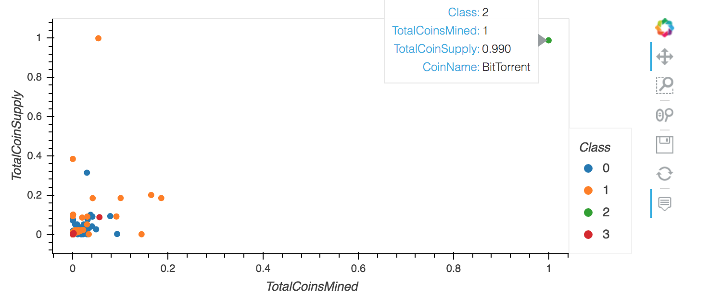

# Unsupervised Machine Learning and Cryptocurrencies

## Overview of Project

The goal of this project is to work with machine learning using unsupervised algorithms, and to explore data when we're not sure what we're looking for.

The following task to complete:
* To create a report that includes what cryptocurrencies are on the trading market and how they could be grouped to create a classification system for new investment.
* To group the cryptocurrencies and decided on a clustering algorithm.

The steps to do the task:
* Preprocessing the Data for PCA
* Reducing Data Dimensions Using PCA
* Clustering Cryptocurrencies Using K-means
* Visualizing Cryptocurrencies Results

## Resources:
* Data sources: crypto_data.csv

## Tools
* Python
* scikit-learn, plotly, hvplot 
* Jupyter Notebook

## Result

By using the elbow curve, it was determined that the best K value was 4.

Based on the scatter plot, it looks like BitTorrent was the only one on class 2.
 
